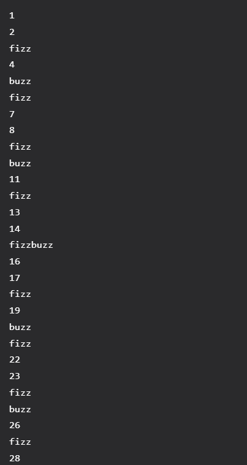

# Fizzbuzz in Python

Fizzbuzz is a group word game for learning division. The goal is to count incrementally, replacing numbers divisible by three with "fizz", numbers divisible by five with "buzz", and numbers divisible by bother three and five with "fizzbuzz". Much like Hello World, Fizzbuzz is a basic program you can create to understand the language's syntax and logic. 

Here is a basic way to create Fizzbuzz in Python. You start off creating a for loop, so the program can iterate through each number, and assign the value to it. The range is 1-101, so it can still process 100. Inside of the loop, you have if, elif, and else statements. These contain the logic for "fizz" "buzz" and "fizzbuzz". For example, "fizz" takes the fizzbuzz value, and see if it is modulus by 3. Modulus returns the remainder when the first operand is divided by the second -- so, if the fizzbuzz value is equal to 0, it will print "fizz". After using similar logic for the "buzz" and "fizzbuzz" cases, we will use an else statement to print the original value.

```
for fizzbuzz in range(1, 101):
    if (fizzbuzz % 3 == 0):
        print("fizz: " + str(fizzbuzz))
    elif (fizzbuzz % 5 == 0):
        print("buzz: " + str(fizzbuzz))
    elif (fizzbuzz % 15 == 0):
        print("fizzbuzz: " + str(fizzbuzz))
    else:
        print(fizzbuzz)
```


---
| [Home](https://github.com/caelenwalker/DigitalConceptTutorial) | [About Python](https://github.com/caelenwalker/DigitalConceptTutorial/blob/main/about.md) | [Hello World in Python](https://github.com/caelenwalker/DigitalConceptTutorial/blob/main/hello-world.md) | 
